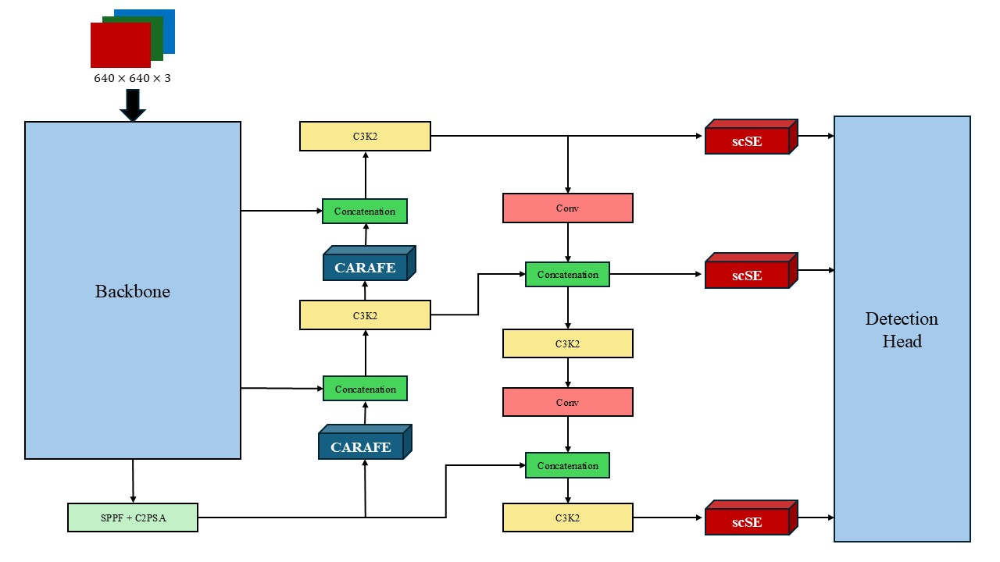

# YOLOv11 with scSE Attention and CARAFE Module

  
   
  <em>YOLOv11 Architecture with CARAFE and scSE modules</em>

## Overview

**YOLOv11_scSE_CARAFE** is a modified version of the existing YOLOv11 model, re-implemented with **PyTorch**.
The motivation for this project was to enhance the model for improved small object detection.
These codes are part of my university project **“Small Object Detection Using Deep Learning”**.

## Highlights

- Added **scSE attention** to emphasize important parts of the feature map in both spatial and channel-wise dimensions.  
- Replaced the traditional upsampling method in **YOLOv11** with **CARAFE**, which adaptively upsamples based on the input feature map.
